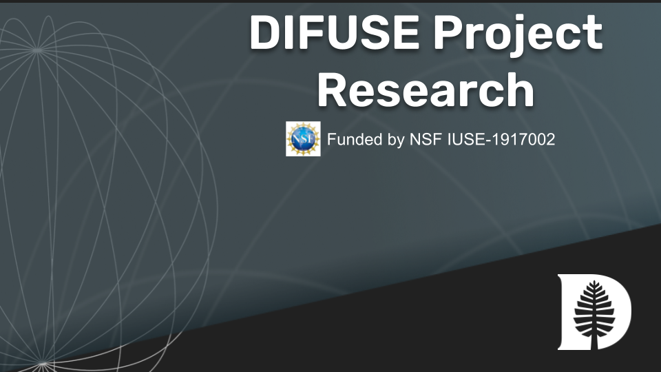

# DIFUSE Research Repository

Part of the DIFUSE project focuses on educational research to determine the impact of the data science modules on students who experience them, as well as the impact of the internship opportunities on students who pursue them.  We have developed and validated a survey instrument, the <a href="https://github.com/difuse-dartmouth/Survey-of-Attitudes-towards-Data-Science">Survey of Attitudes towards Data Science</a> (SADS), which we deploy before and after the module experience.  Data for students in courses with deployed modules is available in this repository (/student-data-23).

We have also run workshops to both disseminate our work and train others to create and/or deploy modules in their own curricula.  For the two workshops in Summer 2022, we also surveyed participants before and after the experience and conducted interviews with some participants.  These data are available in this repository (/workshop-data-2022).

---

## Contents
- _workshop-data-2022_ contains data files for the workshop survey and interviews.
